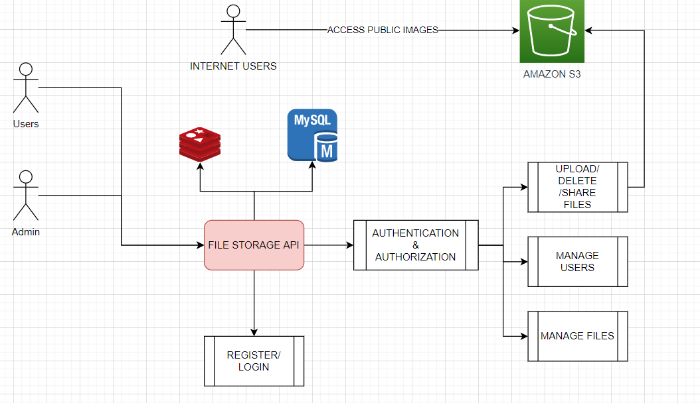
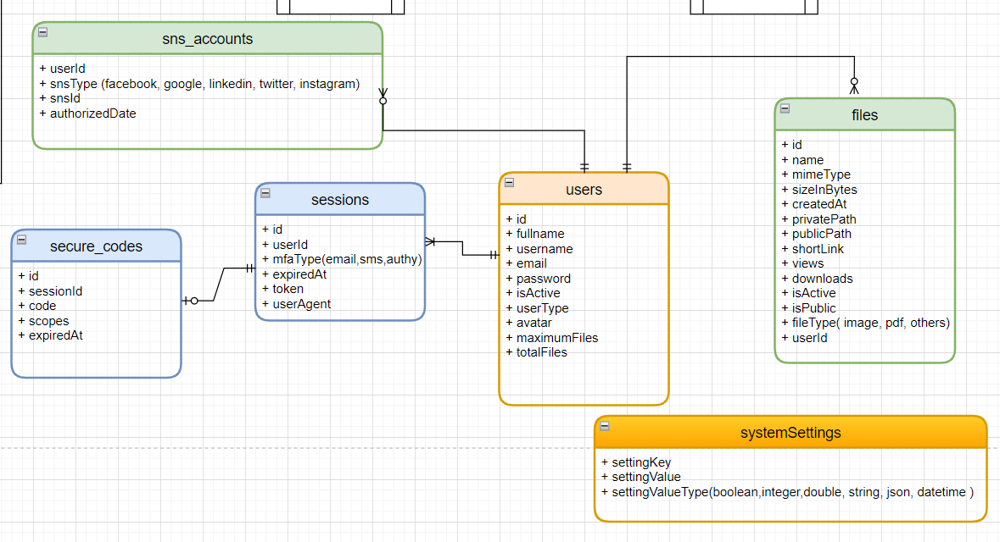

# Build Restful Api With Nestjs the Right Way

## 1st Application : Free image storage

Create Restful API for a image storage service that allow:

1. Users can register to the system. They need to verify their account before using it (via email).
2. Users can only use the system if they have an active account
3. Users can upload images with png,jpg,jpeg format. The maximum size is 5MB
4. User's images won't be public unless they created a shared link and share with other people.
5. User's images can be used on other websites
6. A user has maximum 100 images.
7. A system will delete unused image(unused more than 1 year) automatically every weekends.

Infrastructure requirements:

1. Local : Local Docker
2. Staging: Run on VM with Docker
3. Production: Host everything on AWS

### Overview

### Code Structure

1. solutions
    - deployment -> deployment scripts, dockerfiles, k8s, ...
2. src
- src/share -> Share/Common projects
- src/domain -> Tables mapping
- src/persistences -> TypeORM Core
- src/businesses -> Business logic
- src/application -> applications: file-storage-api, web, queues, ...
- src/tool -> tools: migration data

3. test -> test configuration
