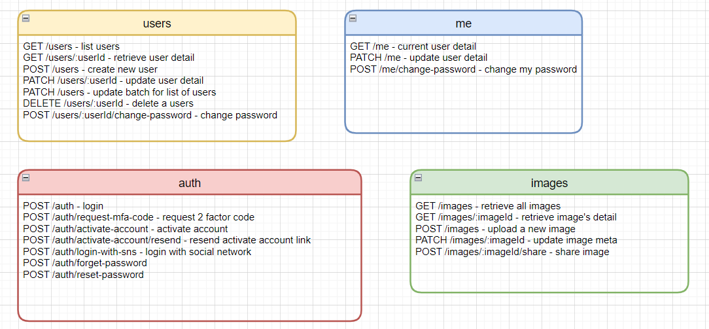
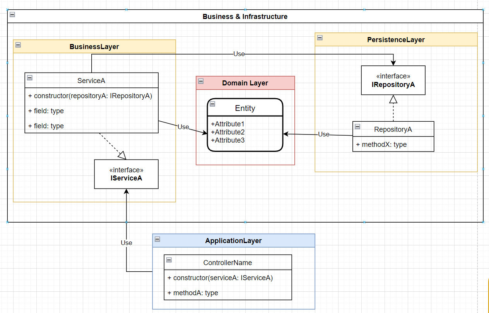
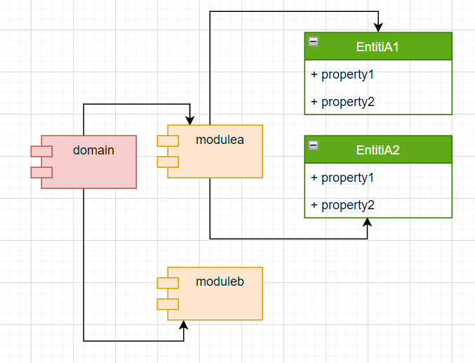
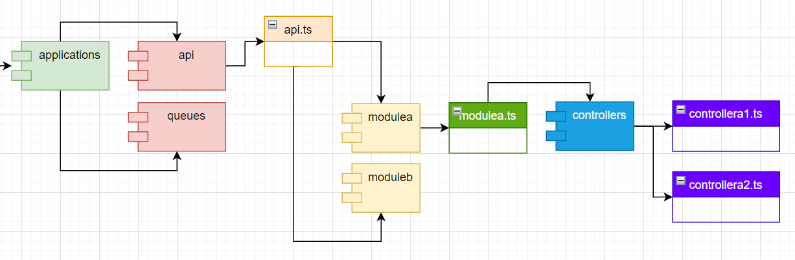
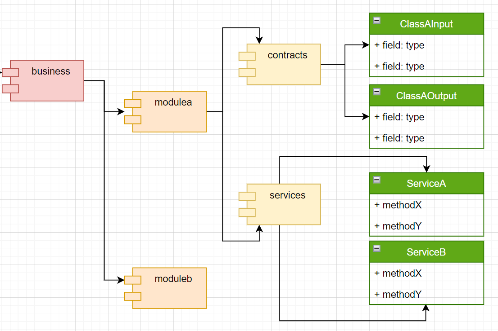
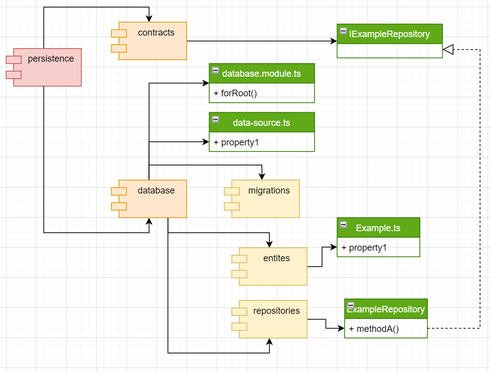
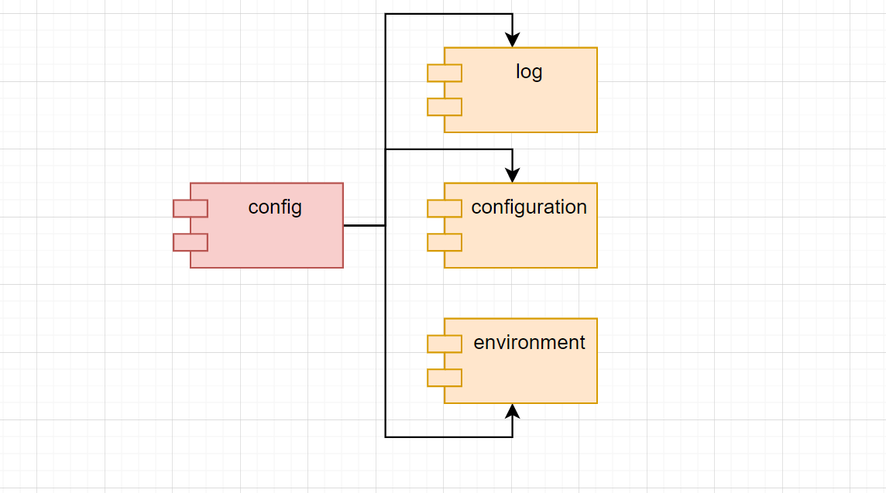

# Build Restful Api With Nestjs the Right Way

## 1st Application : Free image storage

Create Restful API for a image storage service that allow:

1. Users can register to the system. They need to verify their account before using it (via email).
2. Users can only use the system if they have an active account
3. Users can upload images with png,jpg,jpeg format. The maximum size is 5MB
4. User's images won't be public unless they created a shared link and share with other people.
5. User's images can be used on other websites
6. A user has maximum 100 images.
7. A system will delete unused image(unused more than 1 year) automatically every weekends.

Infrastructure requirements:

1. Local : Local Docker
2. Staging: Run on VM with Docker
3. Production: Host everything on AWS

### Overview




### Code Structure

**Overview layers**



1. solutions
   - deployment -> deployment scripts, dockerfiles, k8s, ...
2. src

- src/application -> applications: file-storage-api, web, queues, ...
- src/domain -> Tables mapping
- src/business -> Business logic
- src/share -> Share/Common projects
- src/persistence -> TypeORM Core
- src/tool -> tools: migration data

3. test -> test configuration

**domain layer**



**application layer**



**business layer**



**persistence layer**



**config layer**



### Development

1. Install

```bash
npm install
```

2. Watch

```bash
npm run start:api:dev
```

3. Debug

3.1. Debug main app (file storage api)

F5 -> Select Debug API

3.2. Debug remote

Example: Start app in debug mode - debugger port 9229

```bash
npm run start:api:debug
```

F5 -> Select Debug remote API

### Database

> generate migration script

```bash
npm run typeorm:migration:generate ./src/persistence/database/migrations/migration-script-name
```

> create migration script

```bash
npm run typeorm:migration:create ./src/persistence/database/migrations/migration-script-name
```

> show migration

```bash
npm run typeorm migration:show
npm run typeorm migration:run
npm run typeorm migration:revert
```

>
